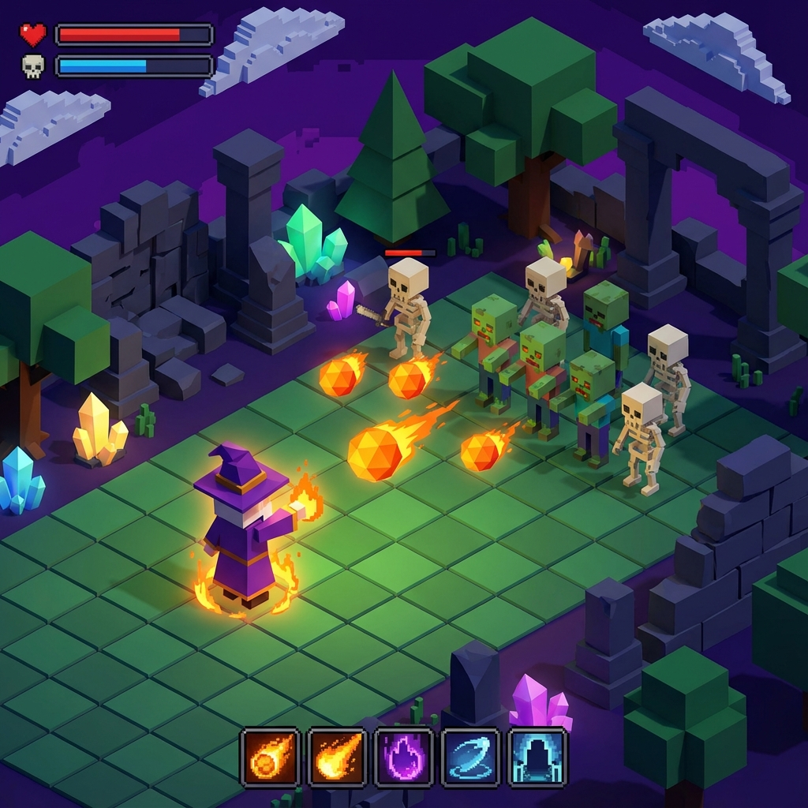

# 🧙‍♂️ WizardBonk 3D



## 🔥 Survive the Horde. Master the Spells.

**WizardBonk 3D** is a high-octane, roguelike horde-survival game built from the ground up using **Python** and **PyOpenGL**. Inspired by the bullet-hell survival genre, you take control of a powerful wizard trapped in a world of blocky horrors. Your goal is simple: survive as long as possible, level up, and unleash devastating spells to clear the screen!

---

## 🌟 Key Features

- **🛡️ Roguelike Progression**: Level up as you defeat enemies and choose from a variety of powerful spells and stat upgrades.
- **👾 Diverse Enemies**: Face off against Zombies, Skeletons, and Creepers, each with unique behaviors.
- **👺 Epic Boss Battles**: Survive long enough to encounter the **Giant Slime** and the **Giant Iron Golem**.
- **💥 Spell System**: Customize your playstyle with spells like *Fireballs*, *Bullet Hell*, *Lifesteal*, and *Rock Armour*.
- **🌑 Multiple Zones**: Battle through the lush Overworld or the perilous Nether.
- **🎥 Dynamic Camera**: Third-person orbit camera for a cinematic tactical view.
- **⚡ Performance Optimized**: Custom AABB collision detection and efficient OpenGL rendering.

---

## 🕹️ Controls

| Key | Action |
| :--- | :--- |
| **W / A / S / D** | Move Character |
| **Right Click + Drag** | Rotate Camera |
| **Space (Optional)** | Use Special Ability |
| **Auto-Attack** | Wizard targets the nearest foe automatically |

---

## 🚀 Getting Started

### Prerequisites

- **Python 3.10+**
- **PyOpenGL**
- **GLUT Library** (FreeGLUT)

### Installation

1. **Clone the repository:**
   ```bash
   git clone https://github.com/your-username/WizardBonk.git
   cd WizardBonk
   ```

2. **Install dependencies:**
   Using `uv` (recommended):
   ```bash
   uv sync
   ```
   Or using `pip`:
   ```bash
   pip install PyOpenGL PyOpenGL_accelerate
   ```

3. **Run the Game:**
   ```bash
   python main.py
   ```

---

## 🛠️ Technical Details

WizardBonk 3D is a showcase of raw OpenGL power in Python:
- **Rendering Engine**: Custom-built using `PyOpenGL` and `GLUT`.
- **Collision**: Custom Axis-Aligned Bounding Box (AABB) implementation for fast entity-to-entity and projectile tracking.
- **AI**: State-based enemy AI for chasing, kiting, and special boss attacks.
- **Math**: Heavily utilizes vector mathematics for movement, projectile trajectory, and camera orbited calculations.

---

## 📜 Project Structure

```text
WizardBonk/
├── main.py              # Main game loop and core logic
├── Wizerdbonk-3D.py     # Alternative all-in-one implementation
├── wizardbonk_hero.png  # Hero art
└── highscore.txt        # local persistence for scores
```

---

## 🤝 Contributing

Feel free to fork this project and submit pull requests! Whether it's optimization, new spells, or new enemy types, all contributions are welcome.

**Happy Bonking!** 🧙‍♂️⚡